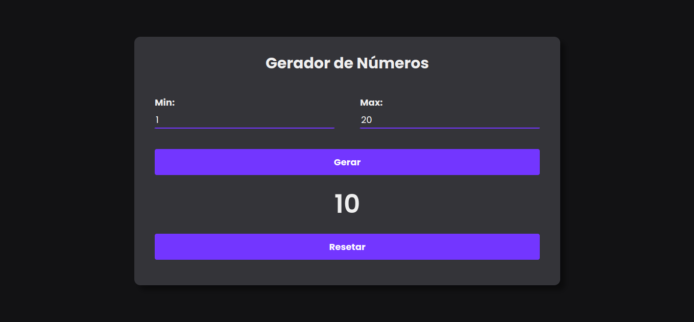

# Gerador de Número Aleatório

Este projeto é um gerador de números aleatórios simples e responsivo, desenvolvido com HTML, CSS e JavaScript. Ele permite ao usuário gerar um número aleatório dentro de um intervalo especificado, com um clique de botão. O design é clean e adaptável a diferentes tamanhos de tela, garantindo uma ótima experiência em dispositivos móveis e desktops.

## Funcionalidades

- **Geração de números aleatórios**: Gera um número aleatório dentro do intervalo definido pelo usuário.
- **Interface intuitiva**: Design simples e fácil de usar, com campos de entrada para o intervalo e um botão para gerar o número.
- **Exibição do resultado**: O número gerado é exibido de forma clara e concisa.
- **Botão de reset**: Consiste também um botão de resetar os valores inseridos.

## Demonstração

## Como Usar

1. Clone o repositório para sua máquina local.
2. Abra o arquivo `index.html` em seu navegador.
3. Insira o intervalo desejado nos campos de entrada.
4. Clique no botão "Gerar" para obter um número aleatório dentro do intervalo.

## Personalização

Você pode personalizar o gerador editando o arquivo `style.css`. Altere as cores, fontes e outros estilos para criar sua própria aparência.

## Contribuições
Sinta-se à vontade para contribuir com melhorias, correções de bugs ou novas funcionalidades. Basta fazer um fork do repositório e enviar um pull request.